# Memespector-GUI

Memespector-GUI is a cross-platform client for computer vision APIs with a graphical user interface.  Memespector-GUI supports [Google Cloud Vision API](https://cloud.google.com/vision/), [Microsoft Azure Cognitive Services](https://azure.microsoft.com/en-us/services/cognitive-services/computer-vision/), [Clarifai Computer Vision](https://www.clarifai.com/) and an API for [Keras' built-in open source models](https://keras.io/api/applications/).

Memespector-GUI runs on Windows, Mac OS and Linux.

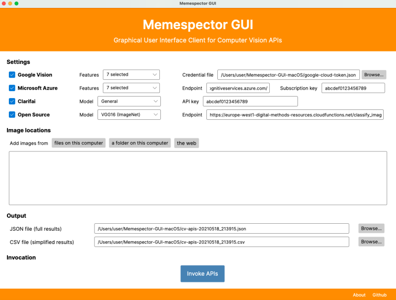

If you use this tool in a scientific scientific publication, please cite it, e.g. in APA style: *Chao, T. H. J. (2021). Memespector GUI: Graphical User Interface Client for Computer Vision APIs (Version 0.2) [Software]. Available from https://github.com/jason-chao/memespector-gui.*

# Contents
* [Download](#download)
* [Gaining access to APIs](#gaining-access-to-apis)
  * Get authentication keys from
    * [Google Vision](doc/GetKeyFromGoogleCloud.md)
    * [Microsoft Azure Cognitive Services](doc/GetKeyFromMicrosoftAzure.md)
    * [Clarifai](doc/GetKeyFromClarifai.md)
* [Usage](#usage)
  * [Change API settings](#change-api-settings)
    * [Google Vision](#google-vision)
    * [Microsoft Azure Cognitive Services](#microsoft-azure-cognitive-services)
    * [Clarifai](#Clarifai)
    * [Open source models](#open-source-models)
  * [Add images to Memespector-GUI](#add-images-to-memespector-gui)
    * [Images on a computer](#images-on-a-computer)
    * [Images on the web](#images-on-the-web)
  * [Edit the names for output files](#edit-the-names-for-output-files)
  * [Invoke the APIs](#invoke-the-apis)
* [Credits](#credits)

# Download

Downlaod [the latest version of Memespector-GUI for Windows, Mac OS or Linux](https://github.com/jason-chao/memespector-gui/releases/).

When you open Memespector-GUI for the first time on Windows or Mac, the operating system may decline to run Memespector-GUI because of tightened security measures.  If this happens, please follow [the instructions on how to allow Memespector-GUI to run at first launch on Windows and Mac](doc/FirstRun.md).

# Gaining access to APIs

You have to get authentication keys from Google Cloud, Microsoft Azure and Clarifai in order to use their APIs.

1. If you wish to use **Google Vision API**, you must obtain a credential key file from Google Cloud.  See [the instructions on how to activate Google Cloud Service and obtain an authentication file](doc/GetKeyFromGoogleCloud.md).
2. If you wish to use **Microsoft Azure Cognitive Services Computer Vision**, you must obtain a service endpoint and subscription key from Microsoft Azure.  See [the instructions on how to activate Microsoft Azure and obtain authentication keys](doc/GetKeyFromMicrosoftAzure.md).
3. If you wish to use **Clarifai**, you must obtain an API key from Clarifai. See [the instructions on how to obtain an API key from Clarifai](doc/GetKeyFromClarifai.md).  

# Usage

*Note:  The graphical user interfaces of Memespsector-GUI are nearly identical across the Windows, Mac and Linux versions.  For illustrative purpose, the screenshots of the Windows version are used in this document.  The following steps also apply to the Mac and Linux versions of Memespector-GUI.*

## Change API settings

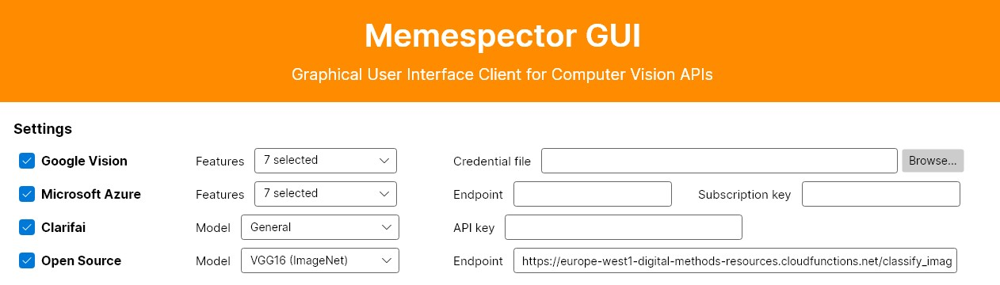

### Google Vision

#### Select the credential key file

Check the box for `Google Vision`.  Click `Browse` to the right of the `Credential file` box.

Select the .json file you downloaded from Google Cloud.  See [the detailed instructions on how to obtain a credential file from Google Cloud](doc/GetKeyFromGoogleCloud.md#obtaining-a-credential-key-file).

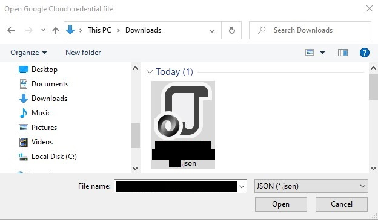

#### Select the features to be detected

Check the features that you want Google Vision API to detect in the images.

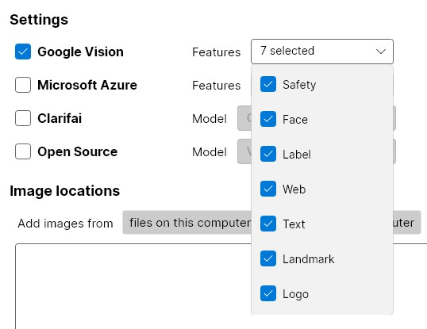

- [Safety](https://cloud.google.com/vision/docs/detecting-safe-search) - adult, violent and racist elements
- [Face](https://cloud.google.com/vision/docs/detecting-faces) - emotional expressions of faces
- [Label](https://cloud.google.com/vision/docs/labels) - generalised labels defined by Google
- [Web](https://cloud.google.com/vision/docs/detecting-web) - web entities (inferred descriptions from similar images on the web), similar images, full/partial matching images, visually similar images and web pages with matching images
- [Text](https://cloud.google.com/vision/docs/ocr) - the text recognised
- [Landmark](https://cloud.google.com/vision/docs/detecting-landmarks) - well-known or prominent sites
- [Logo](https://cloud.google.com/vision/docs/detecting-logos) - logos of popular products

### Microsoft Azure Cognitive Services

#### Paste the Endpoint and Subscription key

Check the box for `Microsoft Azure`.  Paste the Endpoint and Subscription key you obtained from Microsoft Azure into the `Endpoint` and `Subscription key` boxes.    See [the detailed instructions on how to obtain an endpoint and a key from Microsoft Azure](doc/GetKeyFromMicrosoftAzure.md#obtaining-a-service-endpoint-and-a-subscription-key).

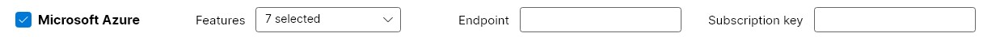

#### Select the features to be detected

Check the features that you want Microsoft Azure Cognitive Services to detect in the images.

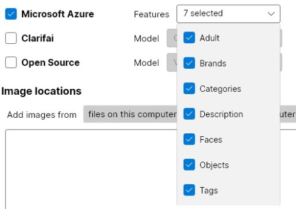

- [Adult](https://docs.microsoft.com/en-us/azure/cognitive-services/computer-vision/concept-detecting-adult-content) - explicitly sexual, sexually suggestive and blood/gore
- [Brands](https://docs.microsoft.com/en-us/azure/cognitive-services/computer-vision/concept-brand-detection) - logos of brands in consumer electronics, clothing and more
- [Categories](https://docs.microsoft.com/en-us/azure/cognitive-services/computer-vision/category-taxonomy) - 86-category taxonomy
- [Description](https://docs.microsoft.com/en-us/azure/cognitive-services/computer-vision/concept-describing-images) - a human-readable sentence that describes the image's contents
- [Face](https://docs.microsoft.com/en-us/azure/cognitive-services/computer-vision/concept-detecting-faces) - human faces with age and gender
- [Objects](https://docs.microsoft.com/en-us/azure/cognitive-services/computer-vision/concept-object-detection) - objects or living things with bounding box coordinates
- [Tags](https://docs.microsoft.com/en-us/azure/cognitive-services/computer-vision/concept-tagging-images) - recognisable objects, living beings, scenery and actions

### Clarifai 

Check the box for `Clarifai`.  Paste the API key you obtained from Clarifai into the `API key` box.  See [the detailed instructions on how to obtain an API key from Clarifai](doc/GetKeyFromClarifai.md#obtaining-an-api-key).

#### Select the computer vision model

Pick the model that you want Clarifai to use to analyse the images.

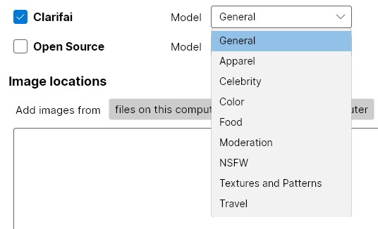

- [General](https://www.clarifai.com/models/image-recognition-ai) - concepts including objects, themes, moods and more
- [Apparel](https://www.clarifai.com/models/clothing-image-recognition) - fashion-related concepts
- [Celebrity](https://www.clarifai.com/models/celebrity-face-recognition) - recognised celebrities 
- [Color](https://www.clarifai.com/models/color-detection) - dominant colours present
- [Food](https://www.clarifai.com/models/ai-food-recognition) - food items
- [Moderation](https://www.clarifai.com/models/ai-image-moderation) - gore, drugs, explicit nudity or suggestive nudity
- [NSFW](https://www.clarifai.com/models/nsfw-model-for-content-detection) - nudity
- [Textures and Patterns](https://www.clarifai.com/models/texture-recognition) - common textures (feathers, woodgrain), unique/fresh concepts (petrified wood, glacial ice) and overarching descriptive concepts (veined, metallic)
- [Travel](https://www.clarifai.com/models/travel-image-recognition) - specific features of residential, hotel and travel-related properties

### Open source models
 
*Caution: The API that serves open source pre-trained computer vision models is experimental.  It does not offer the same level of performance as the commercial APIs.  The default endpoint in Memespector-GUI is for evaluation purpose only.*

Check the box for `Open Source`.  

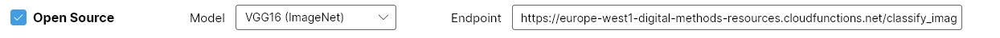

#### Select the convolutional neural network (only if necessary)

The open source models are made available by machine learning library [Keras](https://keras.io/).  These models were trained on the [ImageNet database](https://www.image-net.org/).  Just leave the default option unchanged unless you want to study these models.  The differences between them are in the construction of convolutional neural networks.  If interested in the details, see [here](https://keras.io/api/applications/). 

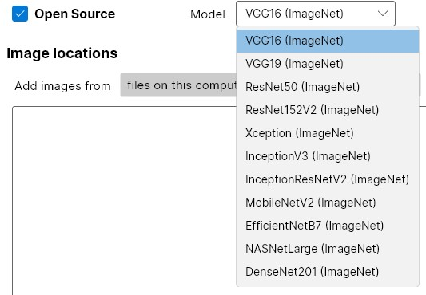

## Add images to Memespector-GUI

### Images on a computer

Click `image files on this computer`.  Select the image files.  Click `Open`.  The locations of the image files will be added to the `Image Sources` box.

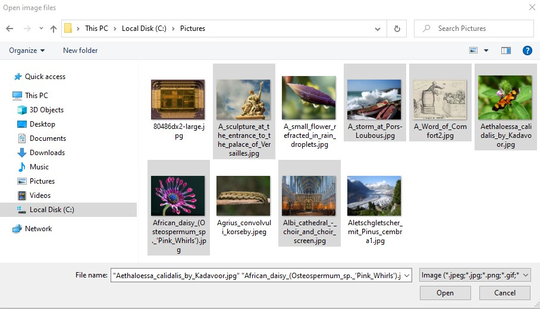

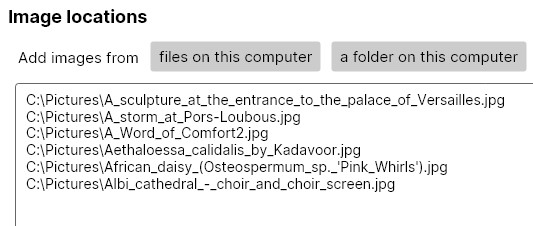

If you want to add all images inside a folder with many sub-folders which also contain images, click `a folder containing images on this computer`.  Select the folder.   The location of the folder will be added to the `Image Sources` box.

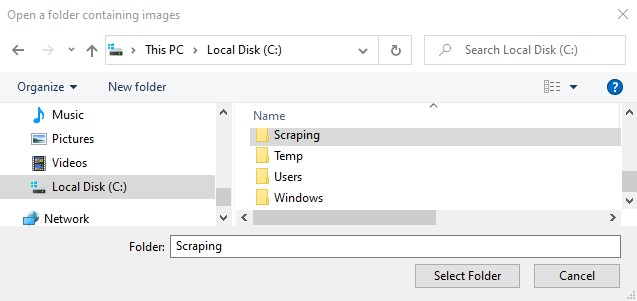

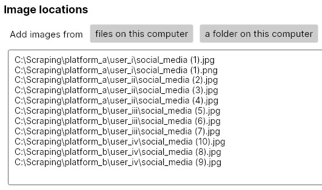

*(Change of display behaviour from Version 0.2.3 beta:  Only the location of the selected (outermost) folder will be displayed in the `Image Sources` box.  The locations of image files inside the folder (and its subfolders) do not have to be displayed in the box in order to be processed.  This change does not affect the total number of image files to be processed.)*

### Images on the web

If you are going to process hundreds or thousands of URLs, paste the URLs into a text (.txt) file.  Put one URL per line.

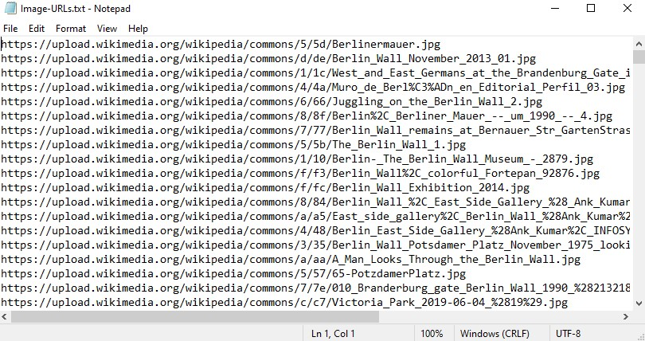

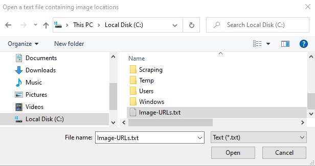

Click `a text file containing image locations`.  Select the text file.  Click `Open`.  The location of the text file containing the URLs will be added to the `Image Sources` box.

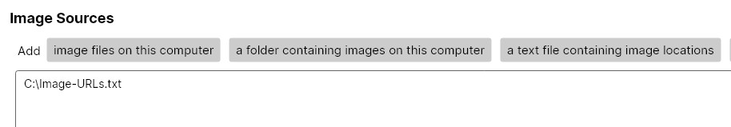

If you are going to just a few or tens of URLs, copy and paste the URLs of the images into the `Image Sources` box.  Put one URL per line.

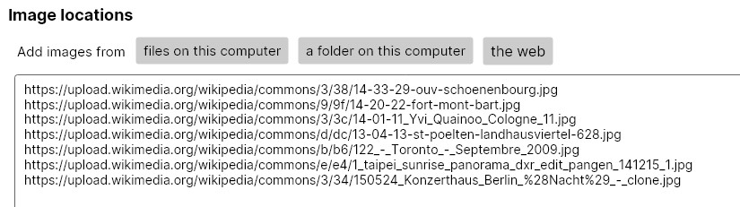

## Edit the names for output files

Memespector-GUI generates two output files.  The JSON file stores the structured data values in full generated by the computer vision APIs.  The CSV file contains a version of the data transformed into a tabular format which may be easily opened using general software tools like spreadsheet editors.

Click `Browser` to the right of each field to change the name and location of an output file.

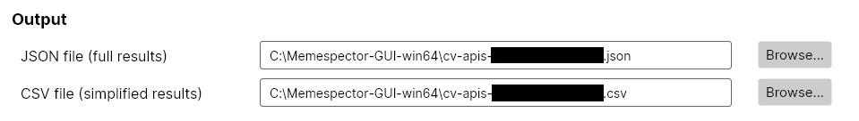

## Invoke the APIs

Click `Invoke APIs` after you have changed the APIs' settings, added image files or URLs to the `Image locations` box and/or edited the output filenames.

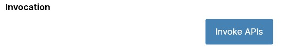

Memespector-GUI will show the progress of sending the images to the APIs.

Once all images are processed, a message about the completion will be shown.  Open the output files to see the results.

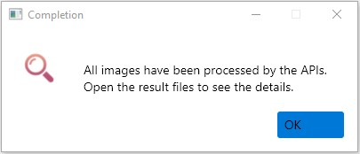

# Credits

Developed by [Jason Chao](https://jasontc.net/).

Special thanks to [Janna Joceli Omena](https://github.com/jannajoceli) for her efforts in idea generation and software testing.

Inspired by the original memespector projects of [bernorieder](https://github.com/bernorieder/memespector) and [amintz](https://github.com/amintz/memespector-python).
