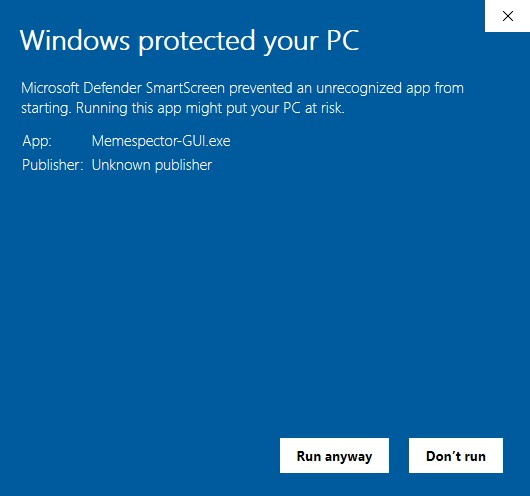
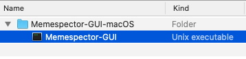
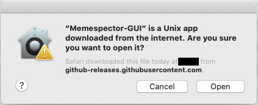
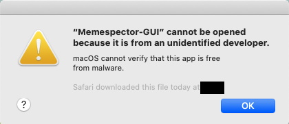
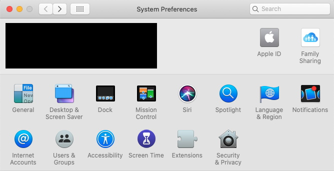
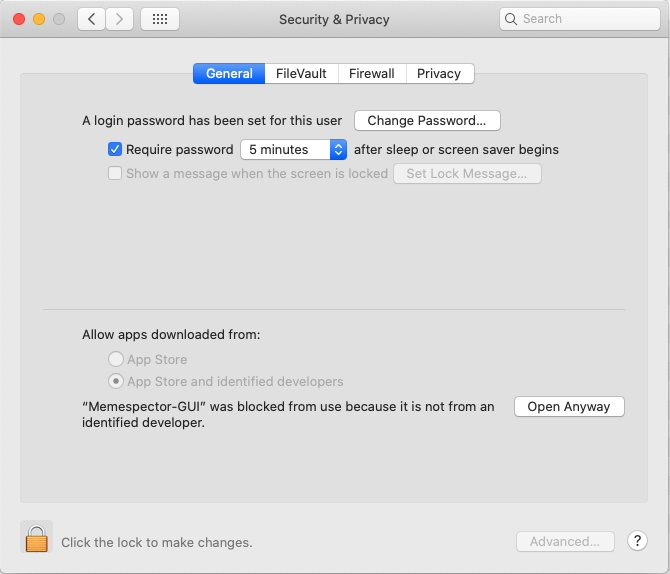
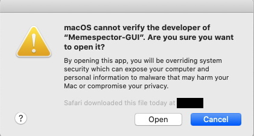

# Allowing Memespector-GUI to run at first launch

When you open Memespector-GUI for the first time on Windows or Mac, the operating system may decline to run Memespector-GUI because of tightened security measures.  You have to take some extra steps to ask Windows or Mac to allow Memespector-GUI to run on your computer.

Usually, you will only need to take these extra steps once.  Next time, Memespector-GUI should run without further hindrance. 

## Operating system-specific instructions
* [Windows](#on-windows)
* [Mac](#on-mac)

## On Windows

After extracting the zip file, you will see the file `Memespector-GUI.exe` with an eye's icon. (Note: The file extension .exe may be hidden depending on the settings.)  Double click on it to open Memespector-GUI.

If you see a window telling you not to run the app, click `More info`.

You will see that a new button will appear at the bottom.  Click `Run anyway`.  Then, Memespector-GUI should open in a few seconds.

## On Mac

Safari may have extracted the zip file automatically for you after downloading it.  Open the `Memespector-GUI-macOS` folder and click `Memespector-GUI` inside.

If you see a window asking that are you sure you want to open Memespector-GUI, click `Open`.  Then, Memespector-GUI should open in a few seconds.

However, in some cases, you may not see the window above but instead encounter another window without an Open button.  In this case, see the additional steps as follows.

In case you see a window telling you that Memespector-GUI cannot be opened, click `Ok`.

Open [System Preferences](https://support.apple.com/guide/macbook-pro/system-preferences-apda966cb8af/mac) on your Mac.  Click `Security & Privacy`.

Navigate to the `General` tab.  You should be able to see `"Memespector-GUI" was blocked from use because it is not from an identified developer` at the bottom of the tab.  Click `Open Anyway` to the right of that message.

Click `Open`.

