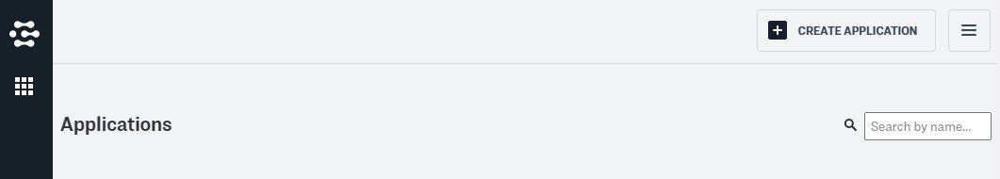
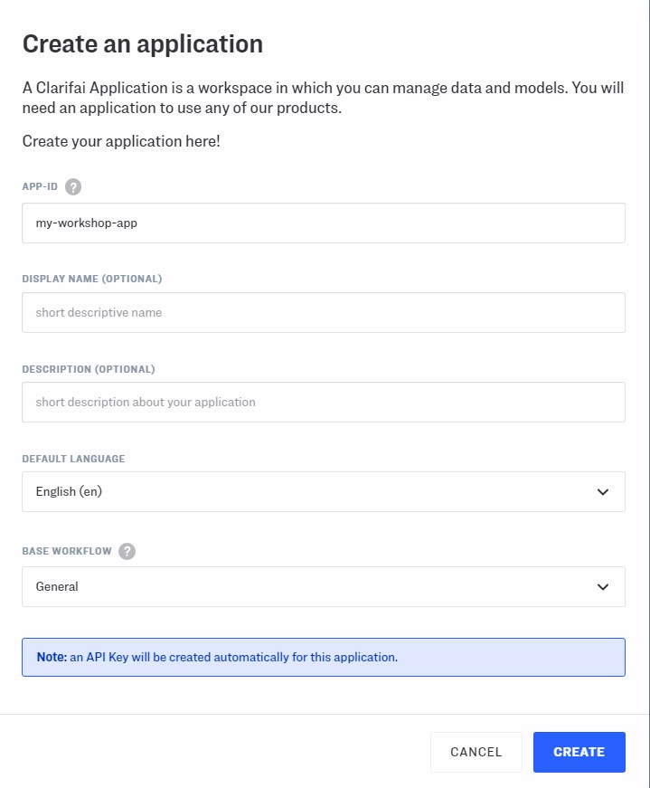
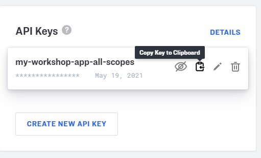

# Signing up for Clarifai

[Sign up for Clarifai](https://portal.clarifai.com/signup) if you do not have an account.  

# Obtaining an API key

After [logging on to Clarifai](https://portal.clarifai.com/login), click `CREATE APPLICATION` on the top right.

Give the application a unique id.  (The id must consist of one or more alphanumeric strings separated by hyphens or underscores. For example, 'id1' and 'id-1' are okay, but '-id1', 'id--1', and 'id_1!' are not okay.)  Then, click `CREATE`.

Click the tile showing application you created just now.

Copy the `API Key` by clicking the clipboard 📋.  Then, paste it to the `API key` box for Clarifai in Memespector GUI. 

