# Signing up for Google Cloud

If you have signed up for Google Cloud already, please jump to [Obtaining a credential key file](#obtaining-a-credential-key-file). 

Log on to [Google Cloud Platform](https://console.cloud.google.com) using your Gmail account.  Click `Activate` on the top right corner or `TRY FOR FREE` in the centre.

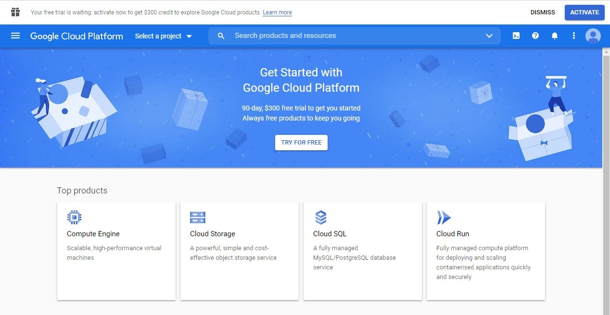

Choose your country and check the box to agree to the service terms.  Click `CONTINUE`.

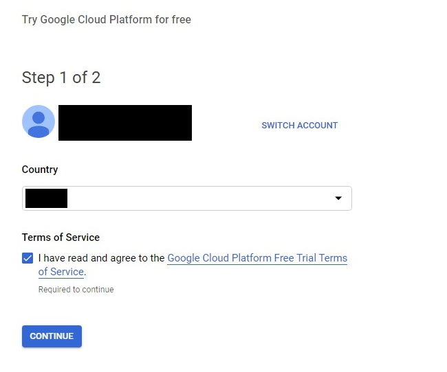

Complete the form with your name, address and details of your payment card.  

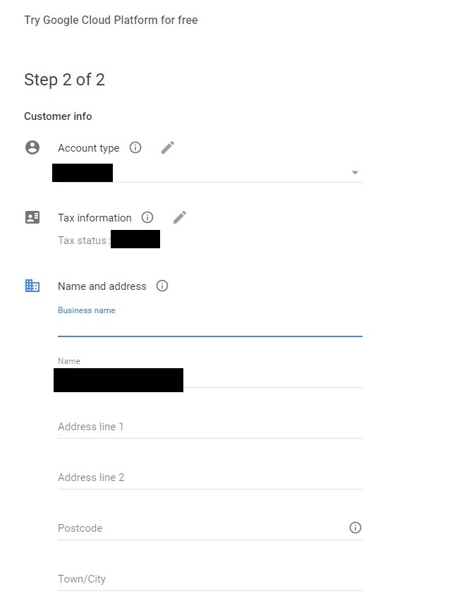

You must provide Google with a valid debit / credit card.  Otherwise, you will not be able to use Google Vision API.  From developers' experience, Google will check if your card is valid but will not charge on your card when you sign up.

Click `START MY FREE TRIAL` when you are done.

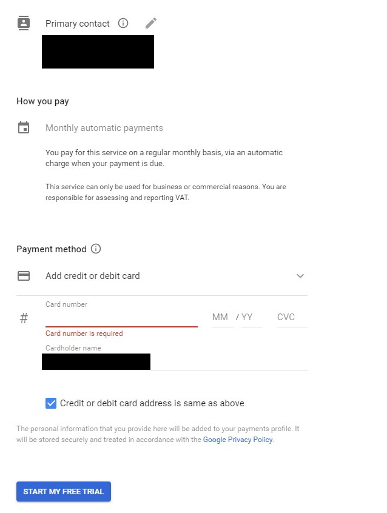

# Obtaining a credential key file

After signing up for Google Cloud, you need to [create a project](#create-a-project), [enable Vision API](#enable-vision-api) and [create a service account](#create-a-service-account) before you can use Google Vision API.

## Create a project

Click `Select a project` on the top.  Then Click `NEW PROJECT`.

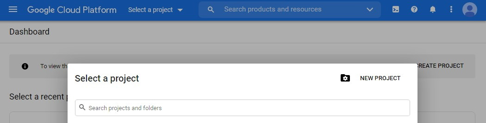

Give a name to the project.  Click `CREATE`.

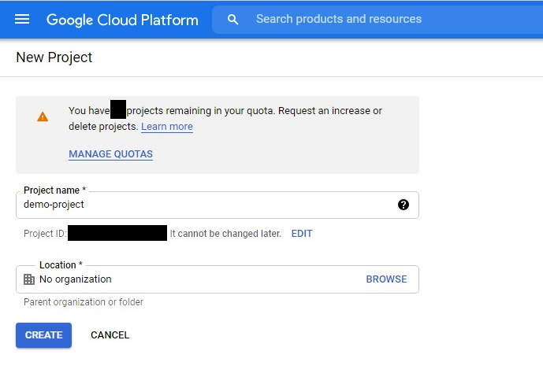

## Enable Vision API

Click the sandwich menu button on the top left.  Navigate to `API & Services` -> `Library`.  

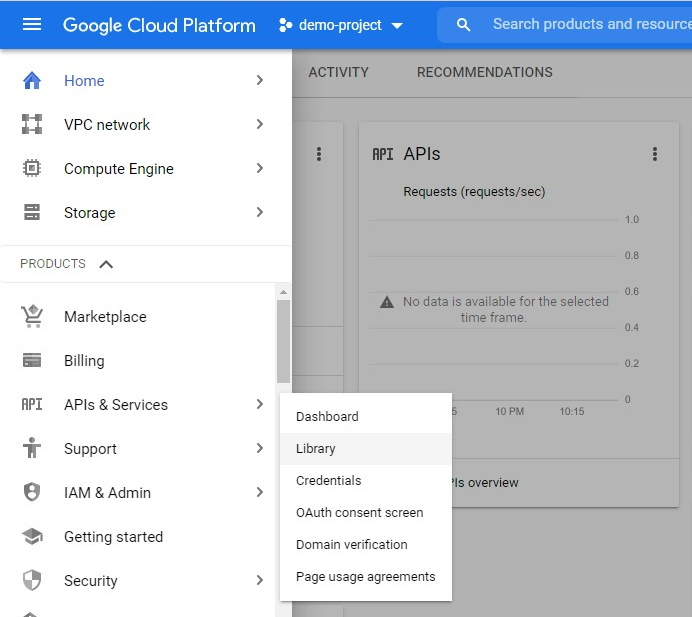

Click `Cloud Vision API`

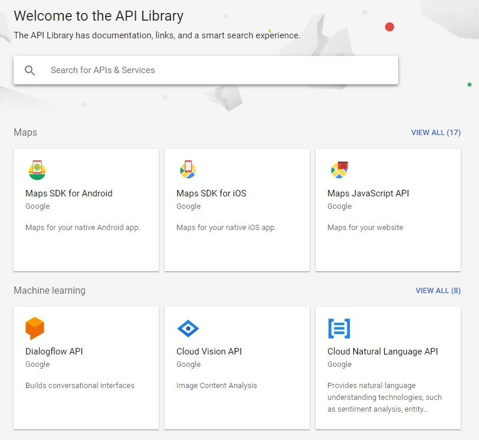

If you are unable to find `Cloud Vision API` for some reason, please type `vision` into the search box.  You should be able to see it now.  Click `Cloud Vision API`.

Click `Enable`

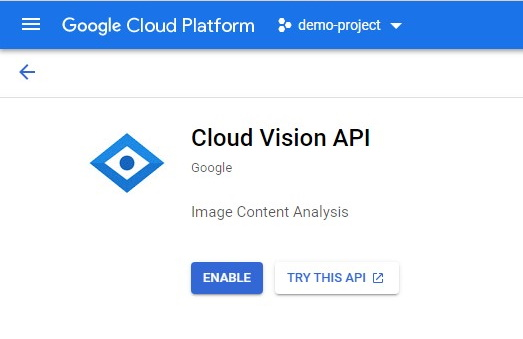

## Create a service account

Click the sandwich menu button on the top left.  Navigate to `IAM & Admin` -> `Service Accounts`.  

Click `CREATE SERVICE ACCOUNT`.

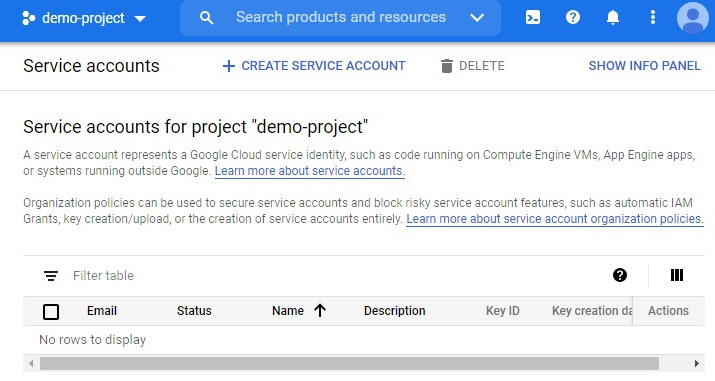

Give a name to the account.  It is usually a name for your computer as service accounts are usually issued to computers.  Click `CREATE`.

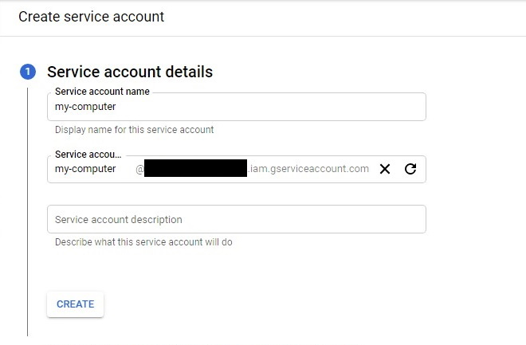

Click `Select a role`

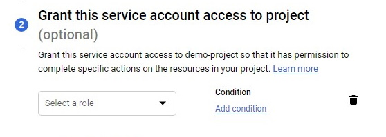

Navigate to `Basic` -> `Owner`.  

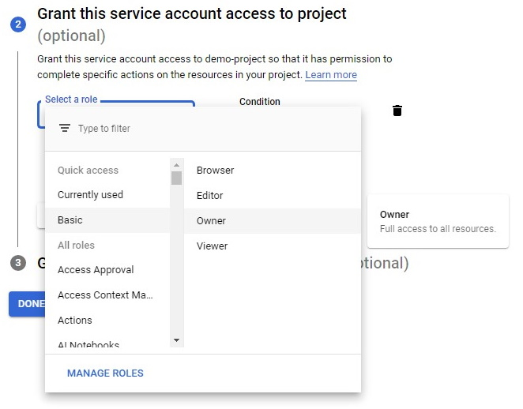

Click `CONTINUE`.

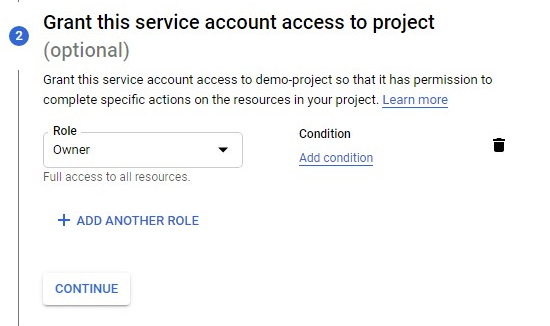

Leave these fields blank.  Click `DONE`.

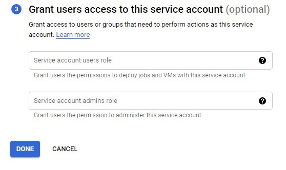

Under `Actions` on the right-hand side, click the sandwich button on the row of the service account you created just now.  Click `Create key`.

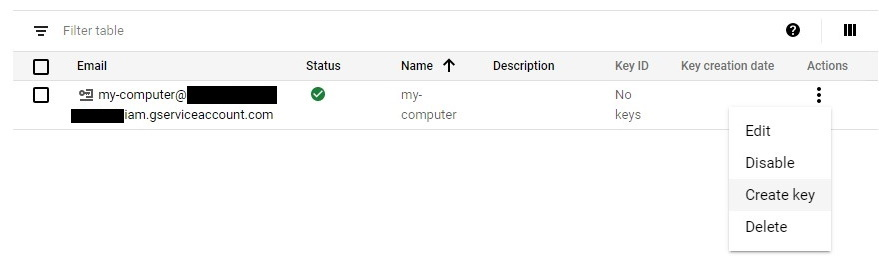

Select `JSON` for `Key type`.  Click `CREATE`.

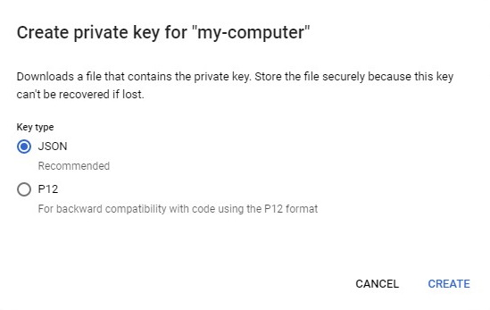

Your browser should automatically download a .json file or ask you to save a .json file.  Please move the credential file to a safe location after downloading.  

In Memespector GUI, click `Browse` and select the downloaded .json file as the `Credential file` for Google Vision. 

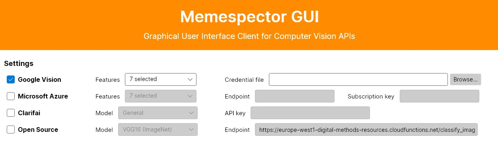
