# Signing up for Azure

Log on to [Microsoft Azure Portal](https://console.cloud.google.com) using your Gmail account.  Click `Portal` on the top right corner.  Then, sign in using your Microsoft account which is usually a hotmail.com or outlook.com email address. 

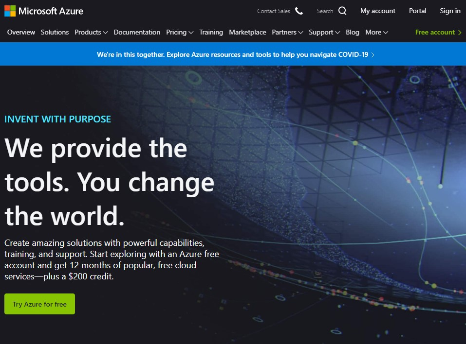

Microsoft may ask you to start a free trial subscription with some credits.  In the process, Microsoft may for your credit card details.  You must provide Microsoft with a valid debit / credit card.  Otherwise, you will not be able to use Microsoft Azure.  From developers' experience, Microsoft will check if your card is valid but will not charge on your card when you sign up.

# Obtaining a service endpoint and a subscription key

After signing up for Microsoft Azure, you need to create Cognitive Services before you can use Microsoft Azure Cognitive Services Computer Vision.

Click `Create a resource`.

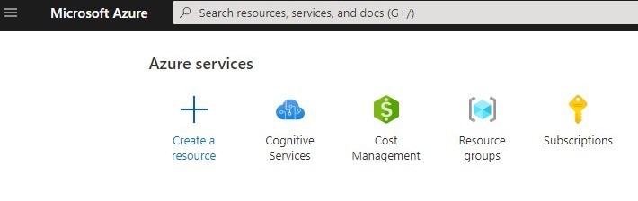

Type `cognitive` in the search bar.  `Cognitive Services` will show up in the auto-complete list.  Click `Cognitive Services` on the list.

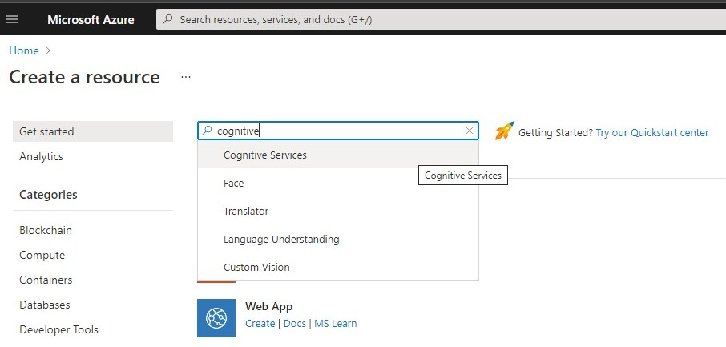

Click `Create`.

You will need to create a `Resource Group` if you do not have one.  In this case, click `Create new` to create one.  Give a name to the resource group, for example, "my-research-resource-group".  Then click `OK`.

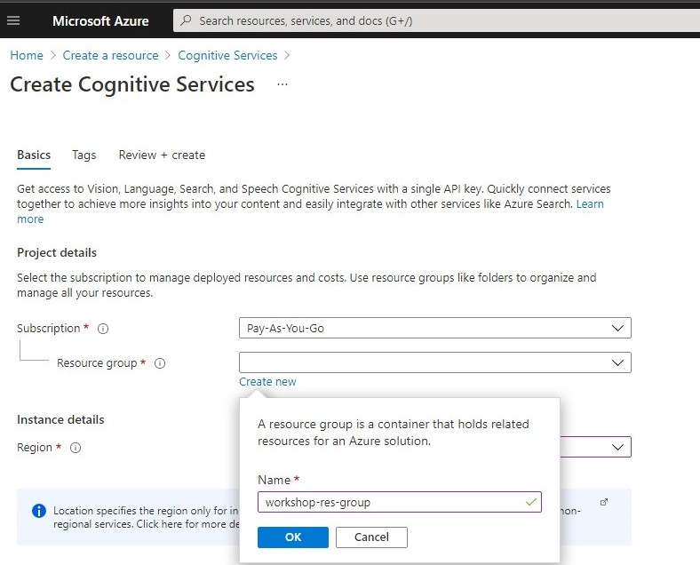

Select a `Region` as close as possible to your physical location. 

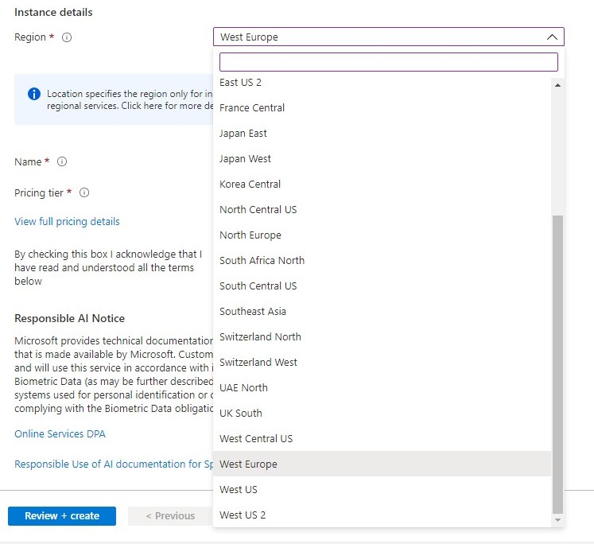

Give a `Name` to your Cognitive Services.  Select a `Pricing Tier`.  Check the checkbox to signify your consent to the terms.  Then click `Review + create`.

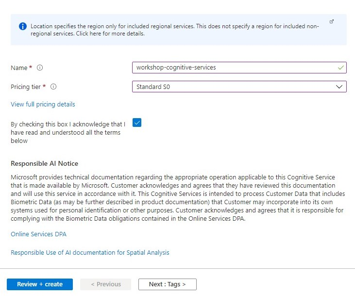

Click `Create`.

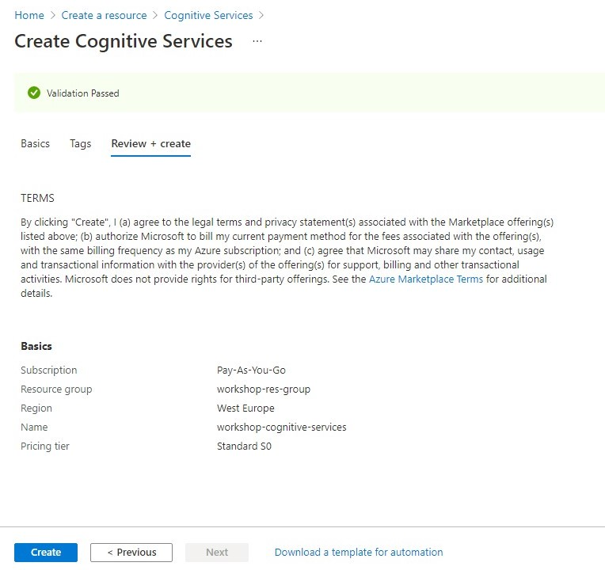

Click `Go to resource`.

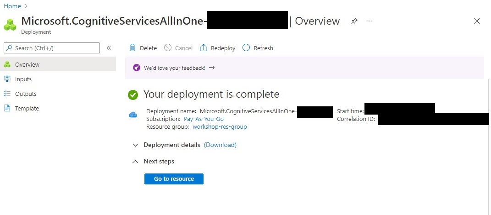

Click `Keys and Endpoint` on the left.

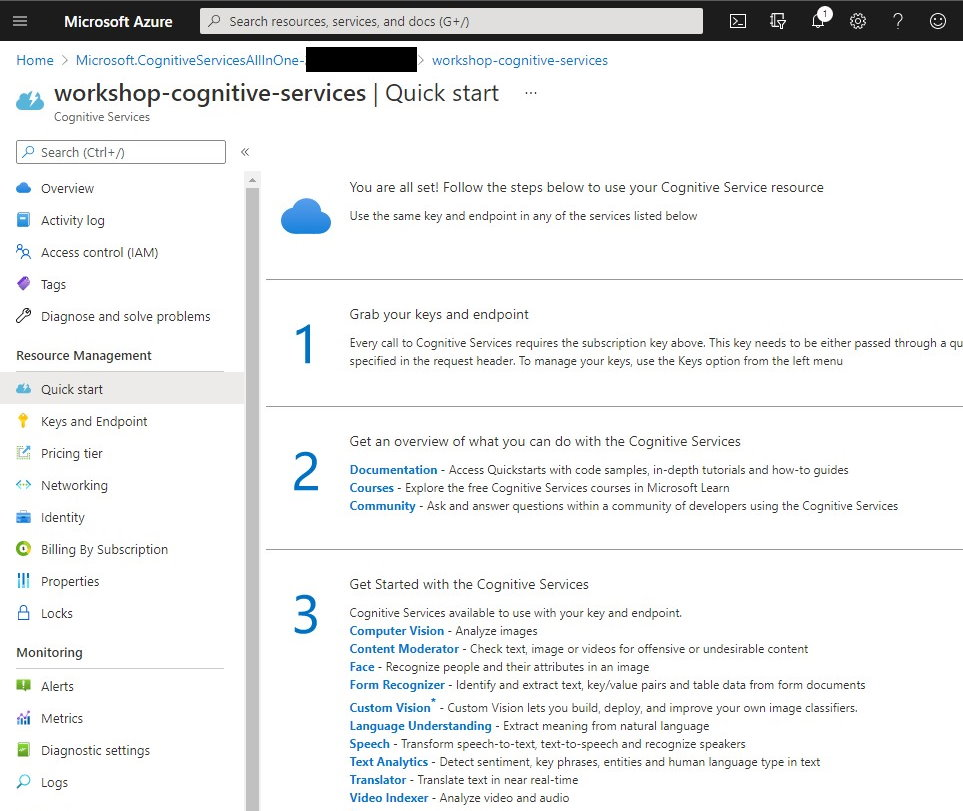

Copy `Endpoint` and paste it to the `Endpoint` box for Microsoft Azure in Memespector-GUI.  Also, copy `KEY1` (or `KEY2` if you like) and paste it to the `Subscription Key` box for Microsoft Azure in Memespector-GUI.

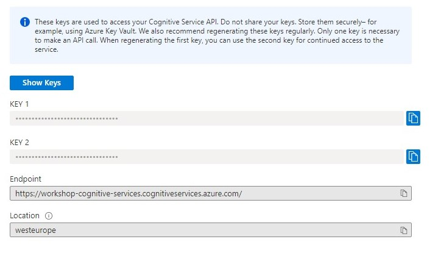

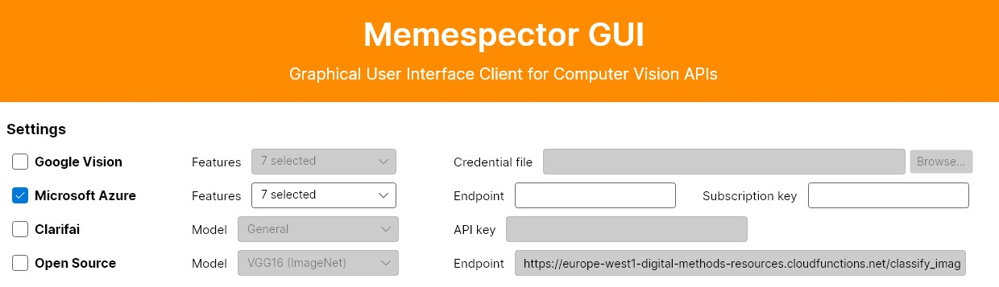
